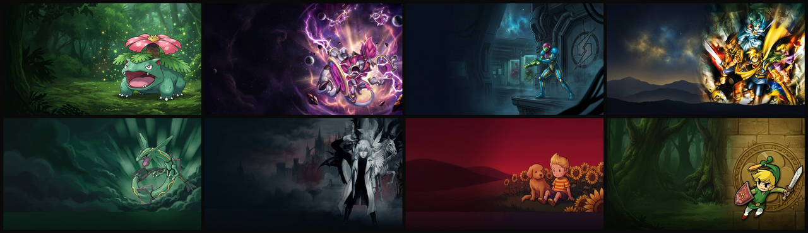

# GBAdhoc Hero Art

Full-screen artwork for the [GBAdhoc](https://github.com/ShoshinFauteux/GBAdhoc) game
browser. 90 cards so far across GBA, Game Boy, and Game Boy Color, plus everything you need to make your own.

### ⬇ Download
- **[⬇ Download Complete Pack (90 cards)](https://github.com/ShoshinFauteux/GBAdhoc-heroart/releases/latest)**
- **[⬇ Download Game Boy (GB) Pack (10 cards)](https://github.com/ShoshinFauteux/GBAdhoc-heroart/releases/latest)**
- **[⬇ Download Game Boy Color (GBC) Pack (7 cards)](https://github.com/ShoshinFauteux/GBAdhoc-heroart/releases/latest)**

Unzip it, copy the files into `PSP/GAME/GBAdhoc/hero/`, done.

---

## Naming

This is the only thing that goes wrong, so it's worth saying first.

Art is matched to a game by filename. Nothing else. No database, no clever matching.

```
roms/Pokemon - LeafGreen Version (USA).gba
hero/Pokemon - LeafGreen Version (USA).png     yes
hero/Pokemon LeafGreen.png                     no
```

Get it wrong and nothing happens. No error, no warning, the game just sits there with no
artwork behind it, which looks exactly like the pack is broken. If a card isn't showing
up, check the name.

The pack uses standard No-Intro names. If your ROMs are named differently, run
`install_heroes.py` from the GBAdhoc repo and it'll match them up and rename as it
copies, then tell you about anything it couldn't place.

## Making your own

`PROMPT.md` is the prompt these were made with. Give it to whatever image generator you
like, ask for 480x272, save the result as your ROM's exact filename, drop it in `hero/`.

Read the notes in there before you change anything. The rules about where to leave space
aren't taste, they're where the browser prints the game title and the file size. Ignore
them and your art will have text sitting on top of the interesting bit. Ask me how I
know.

## Building the pack from source

The 90 originals are in `masters/` at 1376x768. Everything else is generated:

```
python build.py           masters -> build/
python build.py --pack    ...and zip all packs for a release (complete, GB, GBC)
```

Three steps, and each one is there for a reason:

**Deband.** The first prompt asked for a calm dark strip along the bottom and the
generator took that literally, painting a flat rectangle with a hard edge across 10 of
the first 12 images. Looked like a letterbox bar. This finds the step, works out how much
darker it is, divides that back out, and re-applies it as a gradient instead. The
darkening was wanted. The edge wasn't.

**Resize** to 480x272 with Lanczos, so the PSP isn't scaling a 1376px texture down on
every single frame.

**Convert to .565**, which is the PSP's native texture format. The file *is* the texture,
so loading it is one read and nothing else: 112ms as a PNG, 14ms as a .565. Doing the
conversion here also lets us dither it, which the console can't, so gradients come out
cleaner than if you let it convert the PNG itself.

The pack ships both formats. PNGs work fine on their own if you'd rather just drop those
in, the console bakes the .565 itself the first time you look at a game.

## What these are

Generated images. Not scans, not official art, nothing anyone at Nintendo drew.

They're here rather than in the emulator's repo because they're derived from copyrighted
box art and that risk shouldn't sit on the emulator. Same reason RetroArch keeps its
thumbnails separate. If this ever has to come down, GBAdhoc is unaffected.

Personal use. The scripts are GPL-2.0, same as GBAdhoc.

## Missing a game?

Open an issue with the exact ROM filename and I'll add it to the list. Or make one
yourself with `PROMPT.md` and send a PR, plenty of room in `masters/`.
